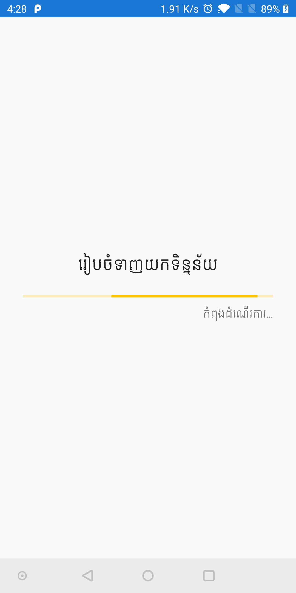
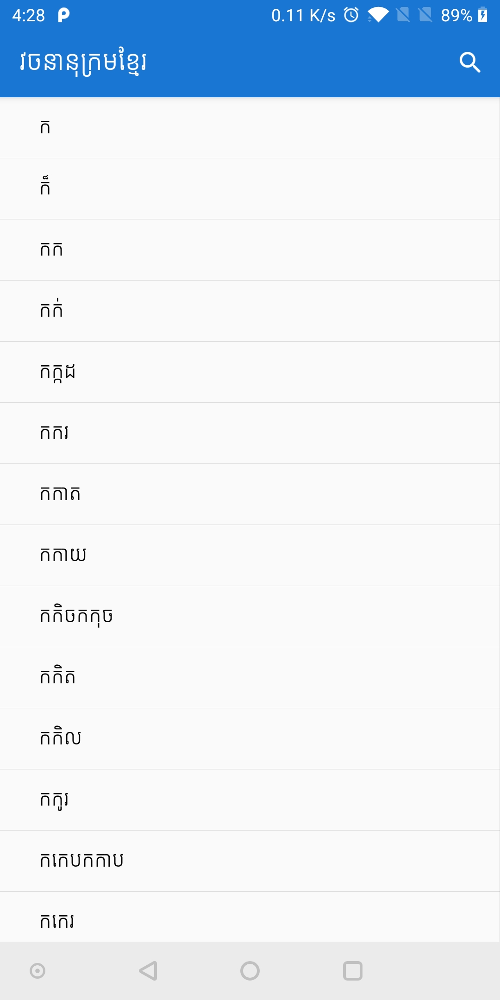
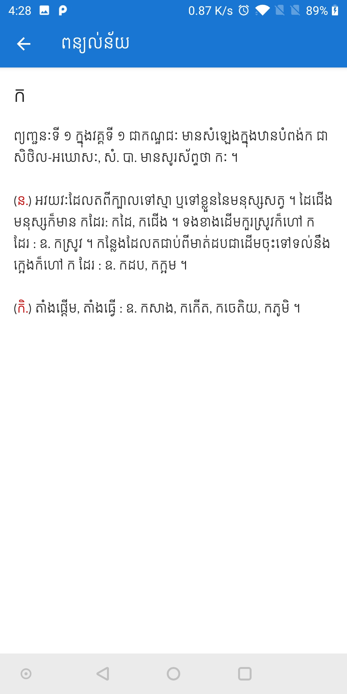
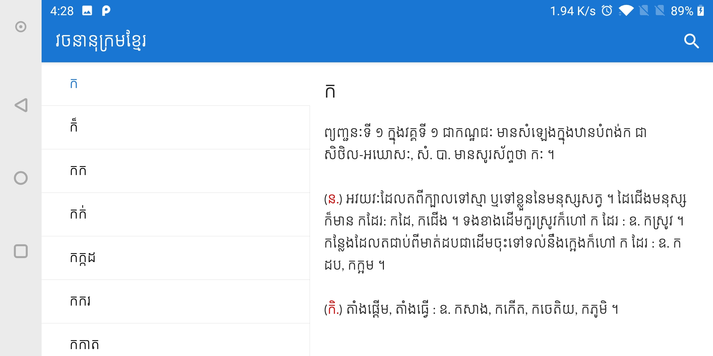

# Khmer-Dictionary
វចនានុក្រមខ្មែរ (ជួនណាត)

# រូបភាព

<table>
  <tr>
     <td>ទាញយកទិន្នន័យលើកដំបូង</td>
     <td>បញ្ជីពាក្យ (បញ្ឈរ)</td>
     <td>ពន្យល់ន័យ (បញ្ឈរ)</td>
  </tr>
  <tr>
    <td valign="top"></td>
    <td valign="top"></td>
    <td valign="top"></td>
  </tr>
  <tr>
    <td colspan="3">បញ្ជីពាក្យ និងពន្យល់ន័យ (ផ្ដេក)</td>
  </tr>
  <tr>
  <td colspan="3"></td>
  </tr>
 </table>
