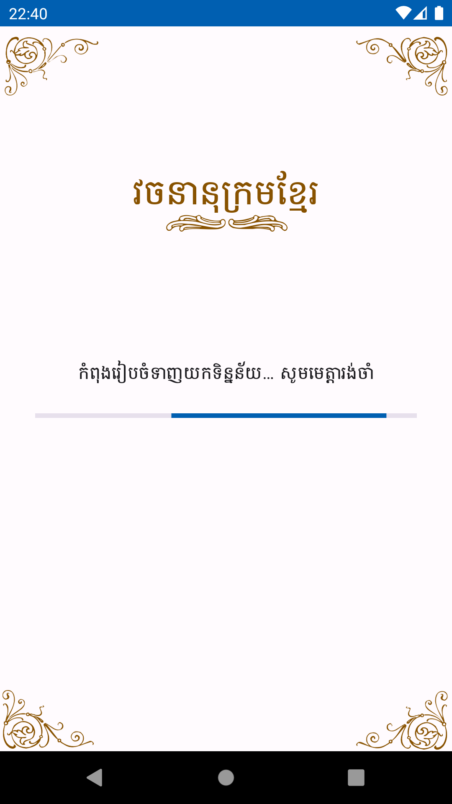
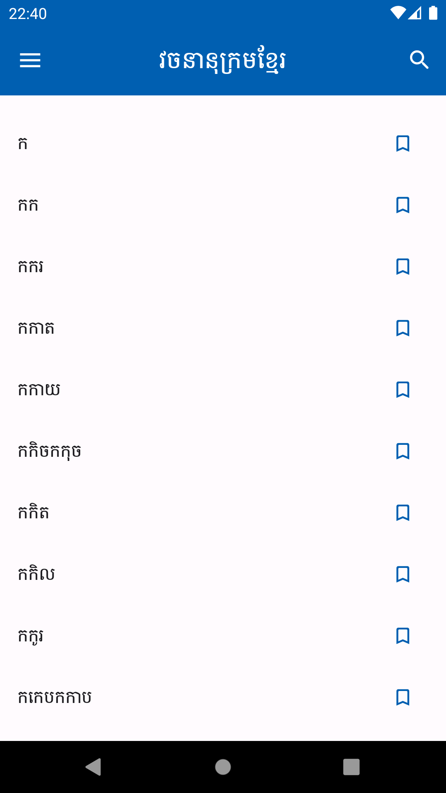
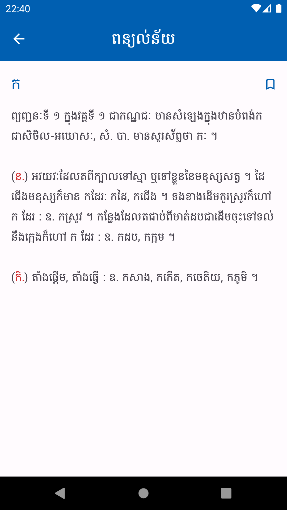
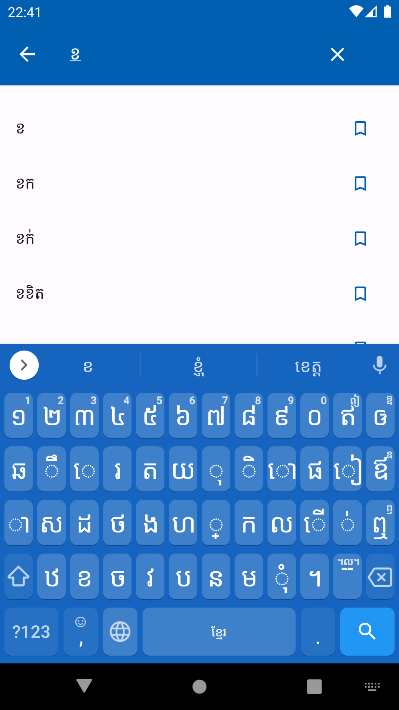
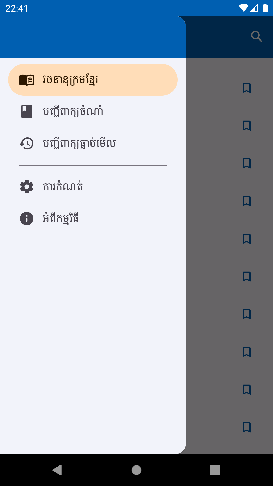
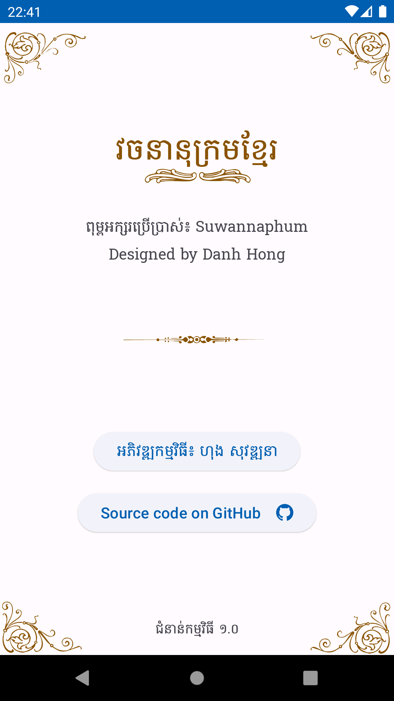
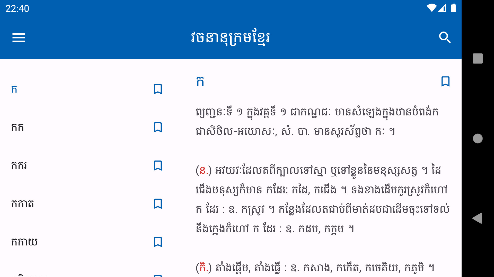
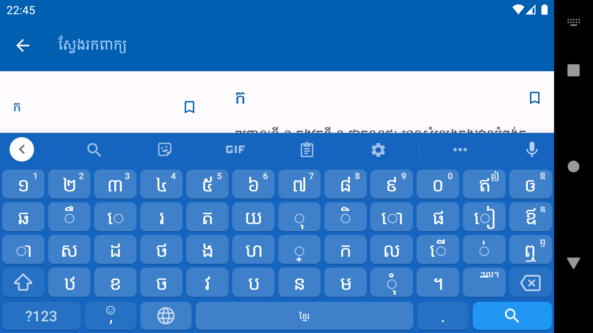

# Khmer-Dictionary
វចនានុក្រមខ្មែរ (ជួនណាត)

# រូបភាព

|ទាញយកទិន្នន័យលើកដំបូង|បញ្ជីពាក្យ|ពន្យល់ពាក្យ|
|---------------------|-------|----------|
||||

|ស្វែងរកពាក្យ|ម៉ឺនុយចំហៀង|អំពីកម្មវិធី|
|---------------------|-------|----------|
||||

|បញ្ជីពាក្យ និងពន្យល់ន័យ (ផ្ដេក)|
|--------------------------|
||

|ស្វែងរកពាក្យ (ផ្ដេក)|
|-----------------|
||
